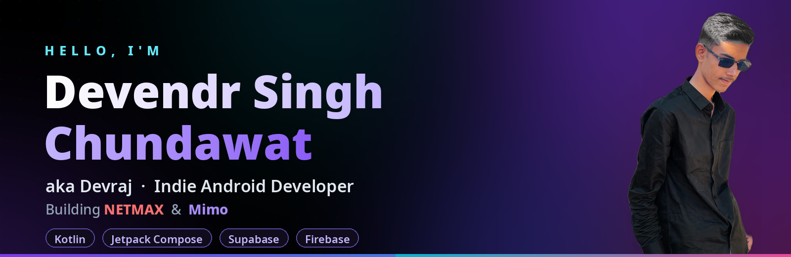
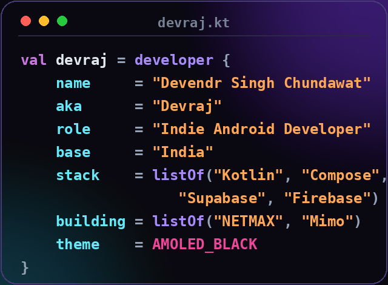
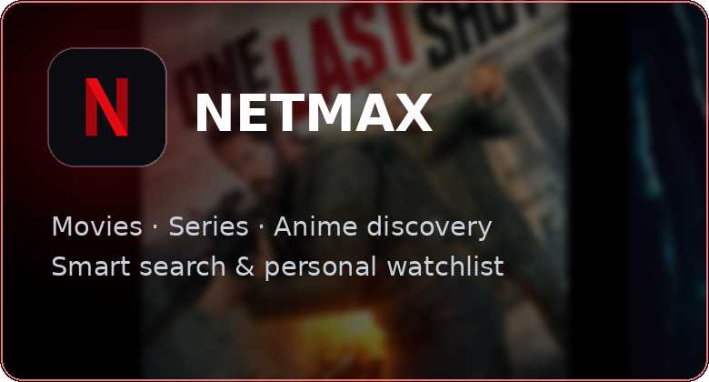
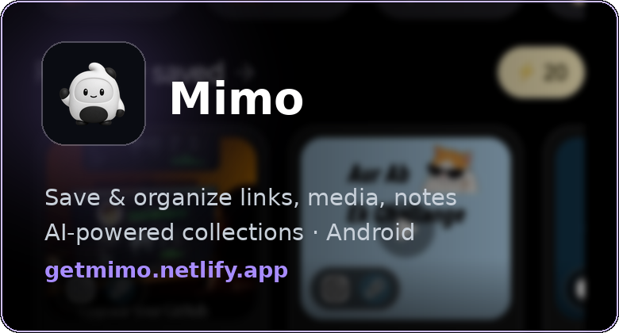

## 👋 About Me

<table>
<tr>
<td width="52%" valign="top">

### ⚡ What I'm up to

- 🎬 Building **NETMAX** - movies, series & anime discovery with a smart watchlist
- ✨ Building **Mimo** - save & organize links, media and notes into AI-powered collections
- 🌱 Leveling up in **Jetpack Compose** & clean Android architecture
- 🎯 2026 goal: ship **NETMAX** and **Mimo** on Google Play
- 🤝 Open to collabs on indie Android projects
- 🌑 Design rule: **AMOLED-black or nothing**

</td>
<td width="48%" valign="top">

</td>
</tr>
</table>

## 🚀 My Apps

<table>
  <tr>
    <td></td>
    <td></td>
  </tr>
</table>

## 🛠️ Tech Stack

## 📊 GitHub Stats

## 🌐 Connect

